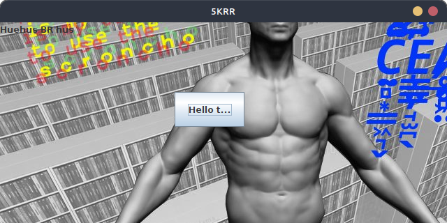
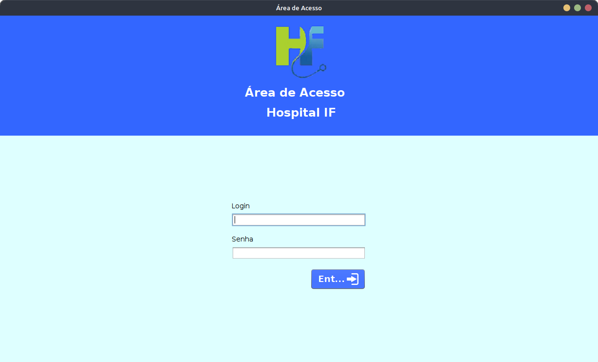
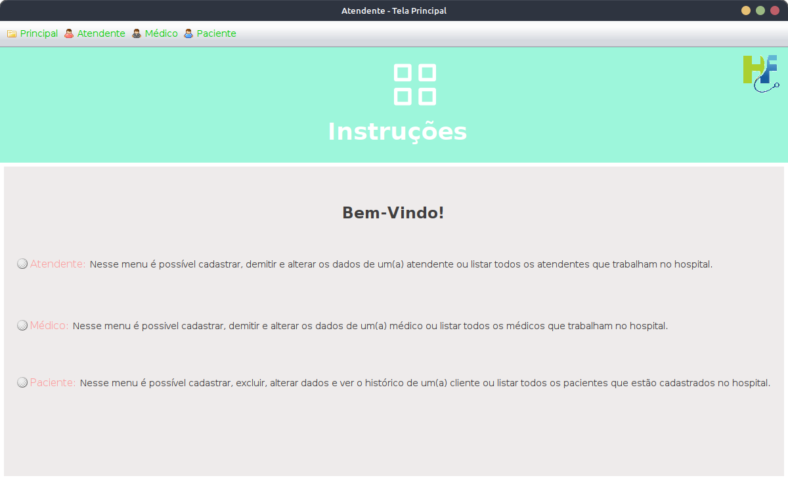
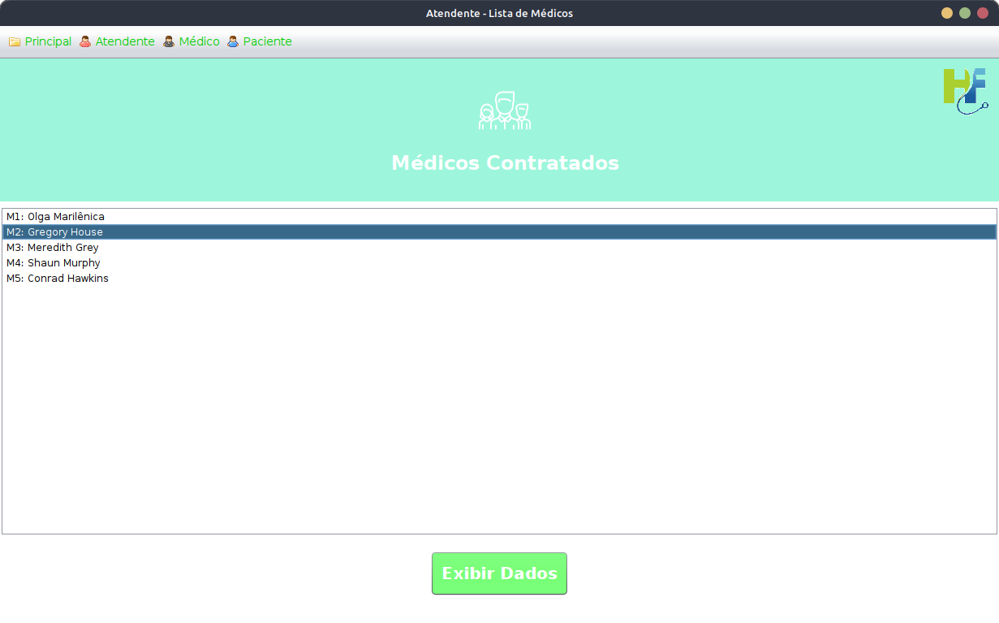
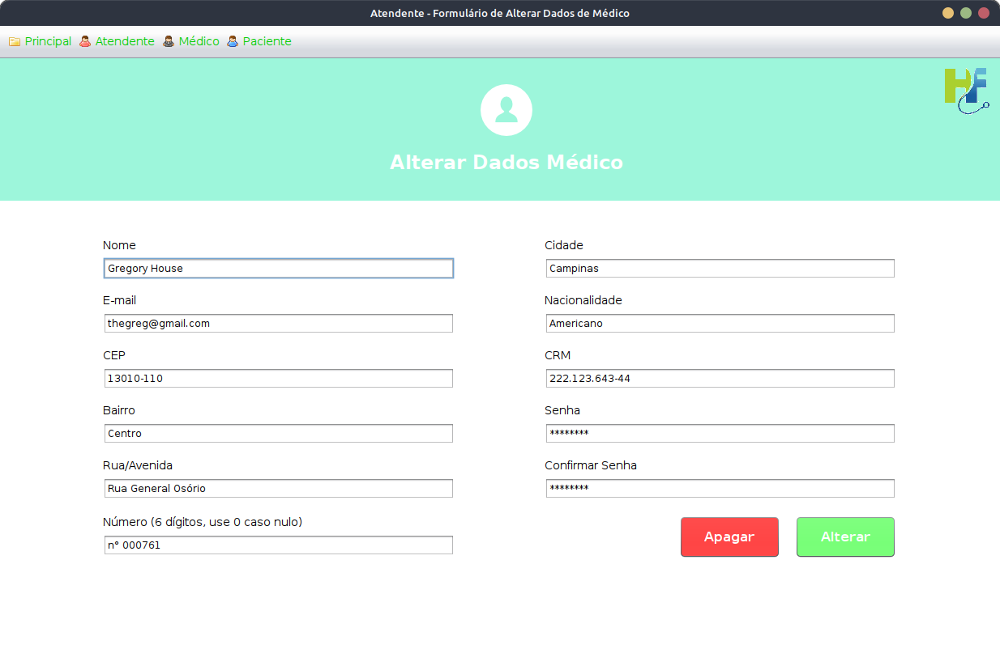
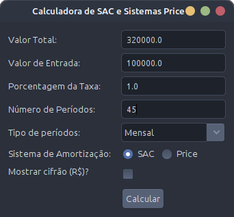
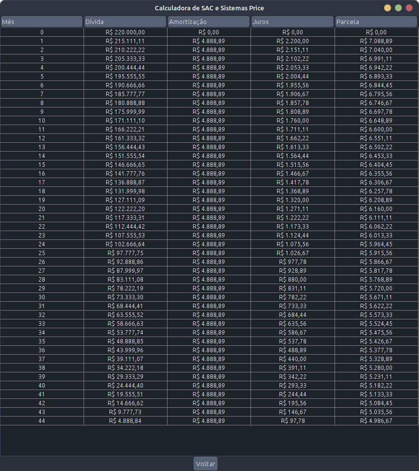

# Compilado de Projetos IFSULDEMINAS 2018-2019

:us:

This is a collection of projects and studies I did back in 2018-2019 when I was learning how to program. I keep this only as an archive, to remind myself of how I used to code back when I was learning.

:brazil:

Este é um compilado de alguns projetos e estudos que fiz enquanto estava aprendendo a programar (2018-2019) no curso técnico em informática no IFSULDEMINAS.

Mantenho este repositório apenas como um arquivo, para relembrar como eu programava quando estava aprendendo.

## Alguns Destaques

<center><h3>Projeto de Programação Orientada a Objetos - Interface Gráfica</h3></center>



<center><h3>Projeto Java - Hospital</h3></center>

|                                                              |                                                              |
| ------------------------------------------------------------ | ------------------------------------------------------------ |
|  |  |
|  |  |

<center><h3>Projeto Matemática - Calculadora de Juros</h3></center>

|                                                                     |                                                                     |
| ------------------------------------------------------------------- | ------------------------------------------------------------------- |
|  |  |

## Rodando os Códigos

### Java

Primeiramente, instale o Java.

Se estiver no Linux, use o script `run_java.sh` para rodar os projetos. Exemplo:

```sh
cd "2018-Java/Atividade Action Event Java/"
../../scripts/run_java.sh Atividade # Utilize o nome da classe que contain o método `main`
```
